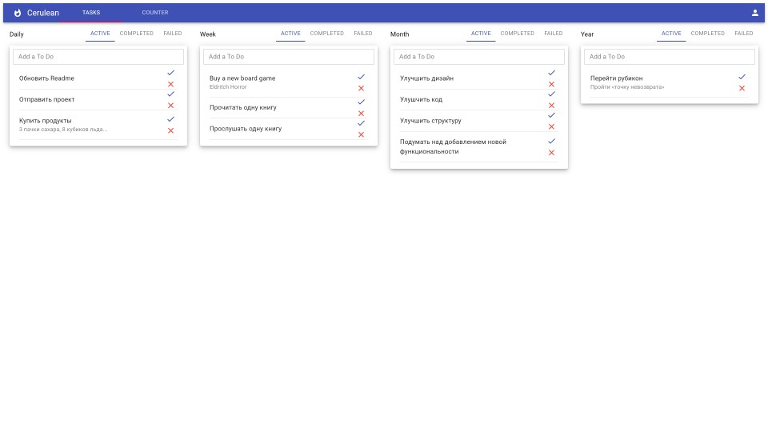
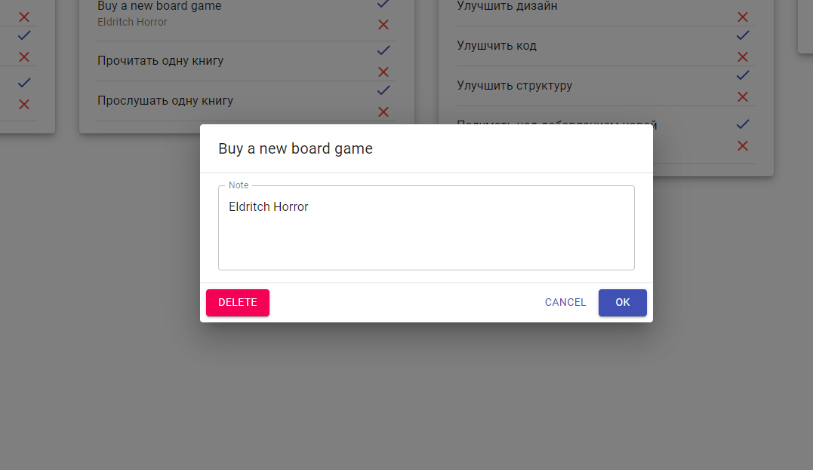
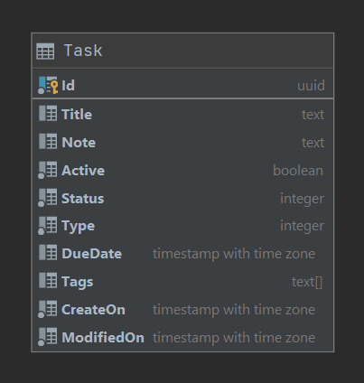
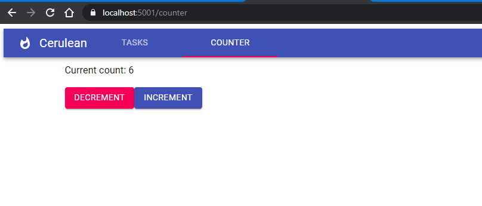

# CeruleanProject

Учебный проект на C# / React / Postrgres  для управления задачами. 

## Features

* 4 типа задач: Daily, Week, Month, Year
* Зачаи могут быть завершены, провалены, удалены, отредактированы
* Почти красивый интерфейс
* Фильтры задач по статусам
* Можно создавать заметки в задачах
* Добавление задач с помощью кнопки "Enter"
* Рабочая навигация по вкладкам!

## Используемые технологии 

* c# 9 with .NET 5 and Entity Framework core
* React with Material UI
* Postgres 13
* ...

## Description

Модальное окно для редактирования записи:

Модель задачи:

Рабочая маршрутизация:

